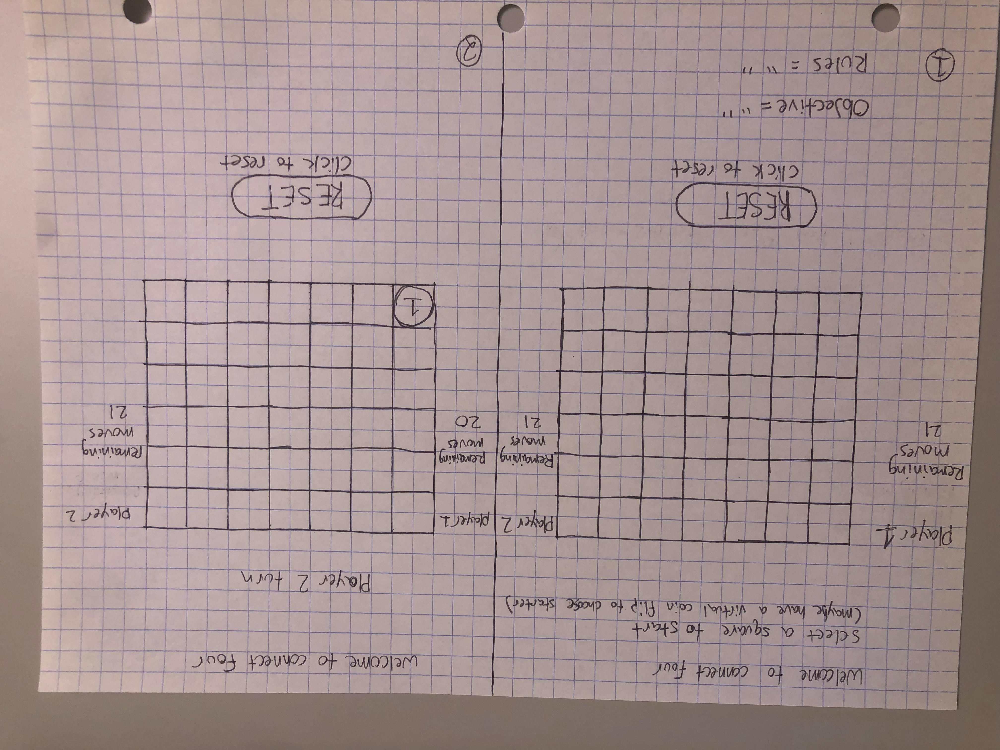
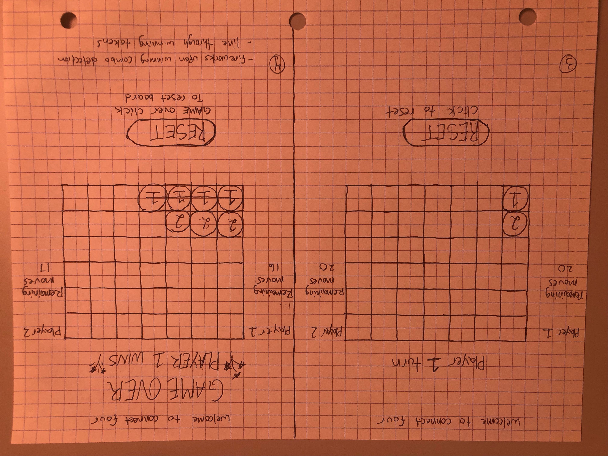
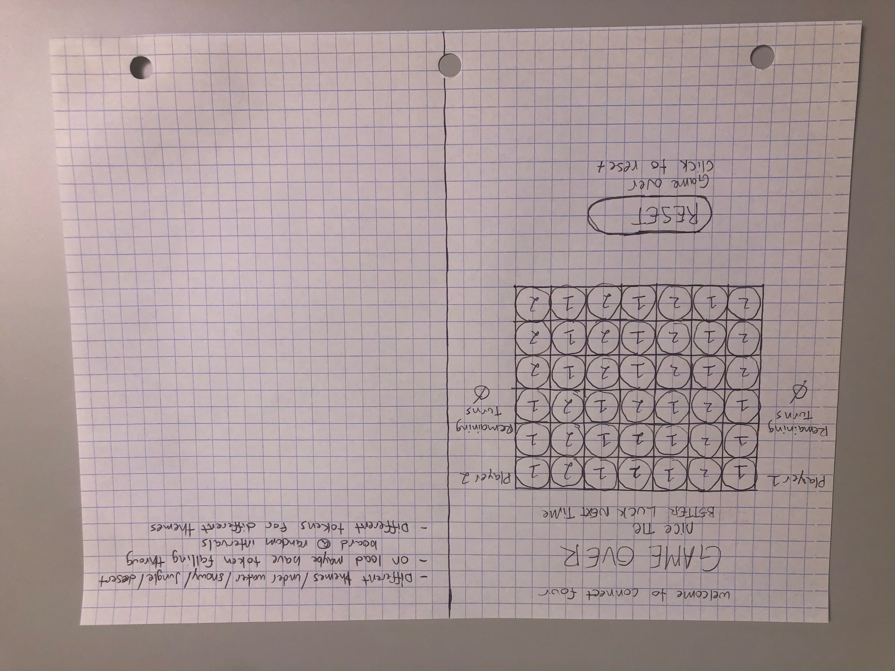

# Project-1-connect-4
User Experience:

welcome to connect four!

1) As a user I expect to see a blank connect four grid with with a virtual coin flip to select the starting player, as well as an objective and the rules of the game.

2) As a user I expect to be able to select a space for my move after the coin has been flipped.

3) As a user I expect to see a turn indicator, indication who turn it is.

4) As a user I expect to have a remaining moves indicator to know how many more moves I have. 

5) As a user I expect to not be able to select spaces that have already been played.

6) As a user I expect a win/loss/tie indicator to pop up when the corrisponding event has happened.

7) As a user I expect to have a reset button to allow for a game reset only if a win tie ir loss occurs.

OBJECTIVE:

- To be the first player to connect 4 of the same colored discs in a row (either vertically, horizontally, or diagonally)

HOW TO PLAY:

- First, have either player select the coin flip button to recieve a color, red will always start the game.

- Players must alternate turns, and only one disc can be dropped in each turn. 

- On your turn, place one of your colored discs into any of the seven slots.

-You can only ony play on a slot directly above a previuolsy filled slot except for when playing the bottom row

- The game ends when there is a 4-in-a-row or a stalemate.

- The starter of the previous game goes second on the next game.

Wire Frames:

